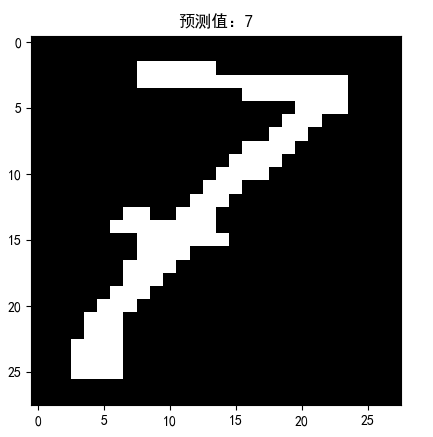

# 手写数字识别
chenhch8

### 环境说明
1. 运行环境: Linux
2. 编译命令: `python3 imgCut.py`
3. 源代码目录: `code/`

## 实验结果
### 算法过程说明
1. 采用hough变化将图像矫正为标准的A4图
2. 使用svm训练手写数字的分类器，这里我采用的训练数据集是mnist
3. 切割字符
4. 使用svm识别并输出连串数字

### 数据预处理说明
数据预处理的逻辑代码放在`preProcess.py`中。处理过程如下：

1. 将mnist的images文件的转化成图片，并从labels文件中获得对于图片的label
2. 提取图片的Hog特征（Hog特征提取方法在报告后面有说明）
3. 将图片的label和Hog特征按照`label value0 value1 ...`的形式保存为测试文件，该文件保存在`img/minst/data/`文件夹下

要运行`preProcess.py`的话，直接运行`py3 preProcess.py`即可

### svm训练说明
svm训练逻辑代码保存在`svm.py`中，它采用的训练数据集是`preProcess.py`的输出结果。生成的训练模型保存为`train_model.m`文件

### 图像数字识别
识别使用的是`svm.py`的训练模型`train_model.m`

1. 字符分割图：
<center>
<figure>
    
    <figcaption>字符串分割图</figcaption>
</figure>
</center>
2. 数字识别：
<center>
<figure style="display: inline-block">
    
    <figcaption>（a）</figcaption>
</figure>
<figure style="display: inline-block">
    
    <figcaption>（b）</figcaption>
</figure>
<figure style="display: inline-block">
    
    <figcaption>（c）</figcaption>
</figure>
<figure style="display: inline-block">
    
    <figcaption>（d）</figcaption>
</figure>
<figure style="display: inline-block">
    
    <figcaption>（e）</figcaption>
</figure>
<figure style="display: inline-block">
    
    <figcaption>（f）</figcaption>
</figure>
<figure style="display: inline-block">
    
    <figcaption>（g）</figcaption>
</figure>
<figure style="display: inline-block">
    
    <figcaption>（h）</figcaption>
</figure>
<figure style="display: inline-block">
    
    <figcaption>（i）</figcaption>
</figure>
<figure style="display: inline-block">
    
    <figcaption>（j）</figcaption>
</figure>
<figure style="display: inline-block">
    
    <figcaption>（k）</figcaption>
</figure>
<figure style="display: inline-block">
    
    <figcaption>（l）</figcaption>
</figure>
<figure style="display: inline-block">
    
    <figcaption>（m）</figcaption>
</figure>
<figure style="display: inline-block">
    
    <figcaption>（n）</figcaption>
</figure>
</center>
由实验发现，14个字符中，第（i）和（l）个的字符数字识别错误，识别号码为：
<center>

</center>
真实号码为：1247673，8952481。错误率大概为14%，效果不是很理想

### 目录结构说明
```
.
├── code -------------------- 源代码问价夹
│   ├── imgCut.py ----------- 字符串分割与识别代码
│   ├── marphing  ----------- 图像矫正代码
│   ├── preProcess.py ------- 图像预处理代码
│   ├── svm.py -------------- svm训练模型代码
│   ├── toBMP.py ------------ 将mnist文件转换成BMP可视化图像代码
│   └── train_model.m ------- svm模型
├── img
│   ├── output -------------- 矫正图像
│   ├── svm ----------------- svm训练数据
│   └── testData ------------ 实验图像
└── model
    ├── test.py
    └── train_model.m
```

### 实验问题记录
1. 预测图像的样式、大小等都应该与训练图像保持一致：
    - 由于我采用的是mnist数据集来训练数字识别模型，在mnist中，图像的背景色是黑色，数字是白色的，所以在对数字进行预测时，我们也需要将原图进行图像反转
    - 在图像切割获取到目标图像时，刚开始我并未注意将数字放在图像的正中间，这时发现数字识别率非常底，后来返回看mnist的图像，发现它的数字都是位于图像正中间，且数字与图像的四周是有一定距离的。所以我对切割得到的目标图像再进行进一步处理，使之与mnist的图像一致。进过这步处理后，数字识别率大大提升，有原本的28.6%提升到85.8%。
2. 在字符串切割时，噪声会对切割效果造成很大的影响。为了降低噪声带来的影响，我在对原图进行高斯模糊后，还进行了膨胀处理，进行膨胀处理和不进行膨胀处理的效果对比在后面的“字符串切割”中有展示。然后提取边缘图，并选定一个阈值，此处我选定的是160。高于160的像素点设为0，低于的则为255（图像反转）。这样更能突出字符串，提高切割准确率。
3. 对切割时得到分割线，我进行了“聚合”操作，将相近的一些线合并取其中间线，避免重复线的出现。

## 实验原理记录
### 字符串的分割
我采用的是最简单的方法进行字符串的识别分割。以下为我的处理过程：

1. 对图像进行高斯模糊，去除大部分噪声
2. 对模糊图像进行膨胀处理，去除大部分剩余噪声
3. 对图像进行二值化处理，然后提取图像边缘
4. 构建一个滤波器，该滤波器的宽度与图像一致，高度为2。将该滤波器沿着图像Y轴方向，从上向下依次划过，并统计滤波器内值为255的像素的个数。显然，如果统计个数等于滤波器的面积时，则为图像的空白边缘，而当统计个数小鱼滤波器面积时，则为字符串所处区域。进程行此操作，能找出Y轴方向的字符串边缘
5. 对X轴方向的处理与Y轴类似，就不再赘述

下面是进行膨胀处理与不进行膨胀处理后的边缘提取效果图：<br />
<center>
<figure style="display: inline-block">
    
    <figcaption>（a）进行膨胀处理后的边缘图</figcaption>
</figure>
<figure style="display: inline-block">
    
    <figcaption>（b）不进行膨胀处理后的边缘图</figcaption>
</figure>
</center>
根据对比结果，可知经过膨胀处理后，噪声基本上全部去除了，这有利于后续的字符串分割处理。

下面是字符串分割的结果图：
<center>
<figure>
    
    <figcaption>（c）字符串分割图</figcaption>
</figure>
</center>

### 图像特征的提取与训练
本次实验采用的特征是Hog特征，训练方法是svm，选用的数据集是mnist

#### Hog 特征
- hog：方向梯度直方图
- 一种在计算机视觉和图像中用来进行物体检测的特征描述子。在一幅图像中，局部特征的表象和形状能够被梯度和边缘的方向密度很好地描述，而hog通过计算和统计图像局部区域的梯度方向直方图来构成特征
- hog 特征提前步骤：
    1. 图像灰度化
    2. 采用gamma矫正法对输入图像进行颜色空间的标准化。目的是调节图像的对比度，降低图像局部的阴影和光照变化所造成的影响，抑制噪声的干扰
    3. 计算图像每个像素的梯度（方向+大小）。目的是捕获轮廓信息，减弱光照的干扰
    4. 划分图像为小cells，并统计每个cell的梯度直方图，即可形成每个cell的descriptor
    5. 将每几个cell组成一个block（如3*3个cell/block），一个block内所有cell的特征descriptor串联起来便得带该block的hog特征descriptor
    6. 将图像内所有block的hog特征descriptor串联起来就得带该图像的hog特征descriptor，即可供分类使用的特征向量

##### 数字图像梯度
- 图像函数$f(x,y)$在点$(x,y)$的梯度是一个具有大小和方向的矢量。设$G_x$和$G_y$分别表示$x$和$y$方向的梯度，则梯度表示为：
$
\nabla f(x,y)=\left[\begin{matrix}
                G_x \\ G_y
             \end{matrix}\right]
             =\left[\begin{matrix}
                \frac{\partial f}{\partial x} \\
                \frac{\partial f}{\partial y}
             \end{matrix}\right]
$。
- 梯度大小：$|\nabla f(x,y)|=\sqrt{\frac{\partial^2f}{\partial x^2}+\frac{\partial^2f}{\partial y^2}}$；<br />
梯度方向角：$\theta(x,y)=\arctan\left|\frac{\partial f}{\partial y} / \frac{\partial f}{\partial x}\right|$
- 二维图像最简单的梯度近似计算方法：
$
\begin{array}{l}
    G_x=f(x,y)-f(x-1,y) \\
    G_y=f(x,y)-f(x,y-1)
\end{array}
$
- 梯度的方向是函数$f(x,y)$变化最快的方向，故当图像中存在边缘时，一定具有较大的梯度值；当图像中有比较平滑部分时，梯度值变化较小
- 常用的梯度算子：Sobel算子，Robinson算子，Laplace算子

##### 梯度直方图
统计方法

- 假设对每个cell，采用9个bin的直方图
- 统计步骤
    1. 将cell的梯度方法分为9个方向块，并初始化每个bin为0
    2. 遍历该cell的每个像素点，在该像素点的方向梯度所属的bin上，加上该像素点的梯度大小